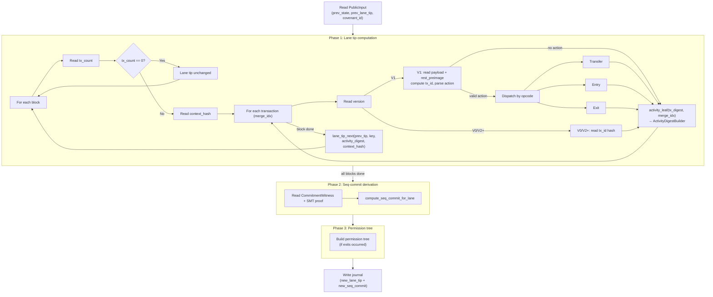

# Guest Proof Pipeline

The guest program is the heart of the rollup. It runs inside the RISC Zero zkVM and executes three phases:

1. **Phase 1 — Lane tip computation:** Process blocks, update state root, and chain lane tips via activity digests
2. **Phase 2 — Seq-commit derivation:** Derive the full `seq_commit` from the lane tip using an SMT proof and commitment witness
3. **Phase 3 — Permission tree:** Build withdrawal permission tree (if exits occurred)

The output journal contains both `new_lane_tip` (UTXO state) and `new_seq_commit` (on-chain verification).

## Overview



## PublicInput

The guest begins by reading `PublicInput` — three 32-byte hashes that anchor the proof to the chain:

- `prev_state_hash` — the SMT root before this batch
- `prev_lane_tip` — the lane tip hash before this batch (stored in the UTXO)
- `covenant_id` — identifies this specific covenant instance

These values are written to the journal so the on-chain script can verify they match the previous UTXO.

## Block processing (Phase 1)

```rust
{{#include ../../methods/guest/src/block.rs:process_block}}
```

Each block starts with a `tx_count`. If zero, the lane was not active in this block and the lane tip is unchanged. Otherwise, the guest reads the block's `context_hash`, then processes each transaction sequentially. Every transaction (regardless of version) contributes to the block's activity digest via `seq_commit_tx_digest(tx_id, version)` and `activity_leaf(tx_digest, merge_idx)`. The finalized activity digest and context hash produce a new lane tip via `lane_tip_next`.

## Transaction classification

```rust
{{#include ../../methods/guest/src/tx.rs:read_v1_tx_data}}
```

Transactions are dispatched by version. V0 and V2+ transactions contribute only a pre-computed `tx_id` hash to the activity digest — no action processing occurs.

For V1 transactions, the guest:

1. Reads the payload bytes from stdin
2. Reads the full `rest_preimage` (length-prefixed) and computes `rest_digest = hash(rest_preimage)` — the guest never trusts a host-provided digest
3. Computes `payload_digest` from the raw payload bytes
4. Computes `tx_id = blake3(payload_digest || rest_digest)`
5. Parses the payload as an action header + data (if 4-byte aligned)

The `rest_preimage` is stored in `V1TxData` and passed to action handlers. For transfer/exit actions, it is used to extract the first input's outpoint (proving which UTXO the transaction actually spends). For entry actions, it is used to parse the deposit output.

Action detection is purely payload-based — all V1 transactions in the rollup lane are potential actions. An action is valid only when the header version and operation are recognized **and** the action-specific validity check passes (e.g., non-zero amount).

## Action parsing

```rust
{{#include ../../methods/guest/src/tx.rs:parse_action}}
```

## Action dispatch

```rust
{{#include ../../methods/guest/src/block.rs:process_action}}
```

## Witness structures

Each action type requires different witness data from the host:

```rust
{{#include ../../methods/guest/src/witness.rs:entry_witness}}
```

**Key simplifications:**

- **Entry witness** no longer includes `rest_preimage`. The current transaction's `rest_preimage` is already read at the `V1TxData` level and passed down.
- **PrevTxV1WitnessData** no longer includes `prev_tx_id` or `output_index`. These are derived from the current action transaction's first input outpoint, which is committed via `rest_preimage` → `rest_digest` → `tx_id`. This prevents the host from substituting a fake previous transaction.

## Conditional witness reading

For transfer and exit actions, the guest reads witness data **conditionally** based on the source account's balance:

```
Host writes:                    Guest reads:
───────────                     ───────────
source AccountWitness           source AccountWitness
  (always)                        verify SMT proof
                                  check balance >= amount?
                                  ├─ NO  → return (nothing more to read)
                                  └─ YES ↓
PrevTxV1Witness                 PrevTxV1Witness
  (if balance sufficient)         verify auth
                                  ├─ FAIL → return (nothing more to read)
                                  └─ OK   ↓
dest AccountWitness             dest AccountWitness     [transfer only]
  (if balance sufficient)         verify SMT proof
                                  update state_root
```

This conditional reading reduces the witness data the host must provide for transactions that fail the balance check. Unknown accounts are represented as empty leaves in the SMT — the guest verifies the empty-leaf proof against the current root, confirms the account has zero balance, and skips the action without needing auth or destination witnesses.

```rust
{{#include ../../methods/guest/src/state.rs:verify_and_debit_source}}
```

## Source authorization

For transfers and exits, the guest verifies that the action's `source` pubkey matches the public key in a previous transaction output:

```rust
{{#include ../../methods/guest/src/auth.rs:verify_source}}
```

The verification chain is:
1. Guest parses the current action transaction's `rest_preimage` to extract the first input's outpoint `(prev_tx_id, output_index)` — this is committed via `rest_digest` → `tx_id`, so tamper-proof
2. Host provides `PrevTxV1Witness` (rest_preimage + payload_digest of the previous transaction)
3. Guest recomputes the previous `tx_id` from the witness and **asserts** it matches the first input's `prev_tx_id` — mismatch means the host is cheating (proof fails)
4. Guest parses the output at the first input's `output_index` from the previous tx's `rest_preimage`
5. Guest checks the output SPK is Schnorr P2PK format (34 bytes) — if not, the action is **skipped** (user error)
6. Guest extracts the 32-byte pubkey and compares with `action.source` — mismatch is a **skip** (user error)

Only Schnorr P2PK sources are accepted — ECDSA and P2SH sources are rejected.

### Assert vs skip

The guest distinguishes between **host cheating** and **user error**:

| Condition | Response | Rationale |
|-----------|----------|-----------|
| Prev tx witness doesn't hash to first input's tx_id | **Assert** (proof fails) | Host provided fake witness data |
| SMT proof doesn't verify against root | **Assert** (proof fails) | Every pubkey has a valid proof (empty leaf by default) |
| Witness pubkey doesn't match action source | **Assert** (proof fails) | Host should always provide matching witness |
| SPK is not Schnorr P2PK | **Skip** (action rejected) | User submitted action with wrong SPK type |
| SPK pubkey doesn't match action source | **Skip** (action rejected) | User made a mistake in the action payload |
| Insufficient balance | **Skip** (action rejected) | User tried to spend more than they have |

## State updates

```rust
{{#include ../../methods/guest/src/block.rs:process_exit}}
```

```rust
{{#include ../../methods/guest/src/state.rs:verify_and_update_dest}}
```

For transfers, the state update is two-phase:
1. **Debit source** — assert SMT proof verifies and witness pubkey matches (host cheating if not), check balance (skip if insufficient), compute intermediate root
2. **Credit destination** — assert SMT proof verifies against intermediate root (host cheating if not), compute final root

For entries, only the credit phase runs (no source debit).

For exits, only the debit phase runs, and a permission leaf is added.

All SMT proof verifications use `assert!` rather than returning `None`, because every pubkey has a valid proof in the sparse Merkle tree (empty leaf by default). If the host provides an invalid proof, it is provably cheating.

## Journal output

```rust
{{#include ../../methods/guest/src/journal.rs:write_output}}
```

The journal is the proof's public output — the only data the on-chain script can see. Its layout:

| Offset | Size | Field |
|--------|------|-------|
| 0 | 32B | `prev_state_hash` |
| 32 | 32B | `prev_lane_tip` |
| 64 | 32B | `new_state_root` |
| 96 | 32B | `new_lane_tip` |
| 128 | 32B | `new_seq_commit` |
| 160 | 32B | `covenant_id` |
| 192 | 32B | `permission_spk_hash` (optional) |

**Base journal:** 192 bytes (48 words) — always present.

**Extended journal:** 224 bytes (56 words) — when exits occurred. The extra 32 bytes contain the blake2b hash of the permission redeem script's P2SH SPK.

## Seq-commit derivation (Phase 2)

After the block loop completes, the guest has the final `lane_tip` but still needs to derive `seq_commit` for on-chain verification. The host provides:

1. A `CommitmentWitness` — a fixed-size POD struct containing `payload_and_ctx_digest`, `parent_seq_commit`, and `blue_score`
2. An SMT proof for the rollup lane's key in the Active Lanes SMT

The guest computes:
1. `smt_leaf = smt_leaf_hash(lane_key, lane_tip, blue_score)`
2. `lanes_root = proof.compute_root(lane_key, leaf)` — verifies the lane's membership in the global lanes SMT
3. `state_root = seq_state_root(lanes_root, payload_and_ctx_digest)`
4. `seq_commit = seq_commit(parent_seq_commit, state_root)`

Both `new_lane_tip` and `new_seq_commit` are written to the journal. See [Chapter 6](ch06-sequence-commitment.md) for the full seq-commit derivation pipeline.

## Permission tree construction (Phase 3)

When exit actions occur, the guest builds a permission tree:

1. Each successful exit adds `perm_leaf_hash(spk, amount)` to a `StreamingPermTreeBuilder`
2. After all blocks, if any exits occurred:
   - The host provides the expected redeem script length
   - Guest computes the tree root with `pad_to_depth`
   - Guest builds the permission redeem script bytes (using the `no_std` builder in core)
   - Guest asserts the built script length matches the host-provided value
   - Guest computes `blake2b(redeem_script)` → the permission SPK hash
3. This hash is appended to the journal

The on-chain state verification script uses the journal's permission SPK hash to verify that the second covenant output (if present) pays to the correct permission script.
