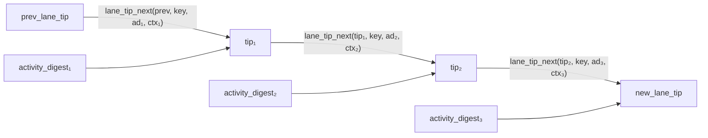
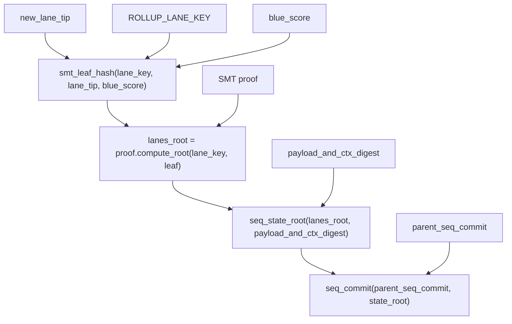

# Sequence Commitment

The sequence commitment anchors the rollup proof to the Kaspa block DAG, ensuring no transactions are skipped, reordered, or replayed between proof batches.

## KIP-21: Lane-based sequencing

The rollup uses the lane-based sequencing commitment defined by [KIP-21](https://github.com/michaelsutton/kips/blob/kip21/kip-0021.md). Instead of a monolithic Merkle tree over all transactions in every block, KIP-21 partitions transactions into **lanes** identified by their subnetwork ID. Each lane maintains its own **activity digest** and **lane tip**, and the final `seq_commit` is derived from lane tips via an Active Lanes SMT. This allows the rollup to process only its own lane's transactions while still anchoring to the full chain's sequencing commitment.

## Lane partitioning

The rollup lane is identified by a fixed subnetwork ID:

```
ROLLUP_SUBNETWORK_ID = [0x42, 0, 0, ..., 0]  (20 bytes)
```

The lane key is precomputed at compile time:

```
ROLLUP_LANE_KEY = H_lane_key(ROLLUP_SUBNETWORK_ID)
```

Only transactions with matching subnetwork ID appear in the rollup lane. The host filters blocks to include only lane transactions; blocks with no lane transactions are skipped entirely.

## Per-block activity digest

Within each active block, every lane transaction contributes to the block's **activity digest**:

1. `tx_digest = seq_commit_tx_digest(tx_id, version)` — keyed BLAKE3, domain `SeqCommitTxDigest`
2. `leaf = activity_leaf(tx_digest, merge_idx)` — keyed BLAKE3, domain `SeqCommitActivityLeaf`
3. Leaves are fed to an `ActivityDigestBuilder` (a streaming Merkle builder)

The `merge_idx` is the transaction's position within the block's mergeset, which enforces ordering — the host cannot reorder transactions.

If a block has zero lane transactions (`tx_count == 0`), the lane was not active. No activity digest or context hash is read, and the lane tip is unchanged.

### Streaming Merkle builder

The activity digest tree is built incrementally using a streaming algorithm that requires no heap allocation:

```rust
{{#include ../../core/src/streaming_merkle.rs:streaming_merkle_add_leaf}}
```

```rust
{{#include ../../core/src/streaming_merkle.rs:streaming_merkle_finalize}}
```

The streaming builder uses a fixed-size stack of `(level, hash)` pairs. When two entries at the same level are adjacent, they are merged into a parent. Incomplete subtrees are padded with zero hashes during finalization.

## Lane tip chaining

Each active block produces a new lane tip by combining the previous tip with the activity digest and a block context hash:

```
lane_tip' = lane_tip_next(prev_tip, lane_key, activity_digest, context_hash)
```

The `context_hash` is a host-provided hash of the block's mergeset context (timestamp, DAA score, blue score).



## Seq-commit derivation

After processing all blocks, the guest derives the final `seq_commit` from the lane tip using a `CommitmentWitness` provided by the host:



The `CommitmentWitness` is a fixed-size POD struct containing:
- `payload_and_ctx_digest` — combined digest of non-lane payloads and context
- `parent_seq_commit` — the previous block's seq commit
- `blue_score` — used for the SMT leaf hash

The SMT proof is a standard sparse Merkle tree proof for the rollup lane's key in the Active Lanes SMT.

## Dual output

The guest commits **both** values to the journal:

- `new_lane_tip` — stored in the covenant UTXO as part of the rollup state. Used as `prev_lane_tip` for the next proof batch.
- `new_seq_commit` — verified on-chain by `OpChainblockSeqCommit`, which recomputes the same value from consensus data.

This separation is necessary because the UTXO needs the lane tip (rollup-specific state), while the on-chain verification needs the full seq_commit (chain-wide commitment that includes all lanes).

## Why this matters

Without sequence commitment verification, a malicious host could:

- **Skip blocks** — omit blocks containing unfavorable transactions
- **Reorder blocks** — change the order of state transitions
- **Replay blocks** — process the same transactions twice

The lane tip chains each block's activity, and the seq_commit anchors this to the actual Kaspa DAG. The on-chain `OpChainblockSeqCommit` opcode recomputes the same value from consensus data, ensuring the guest processed exactly the right blocks.
